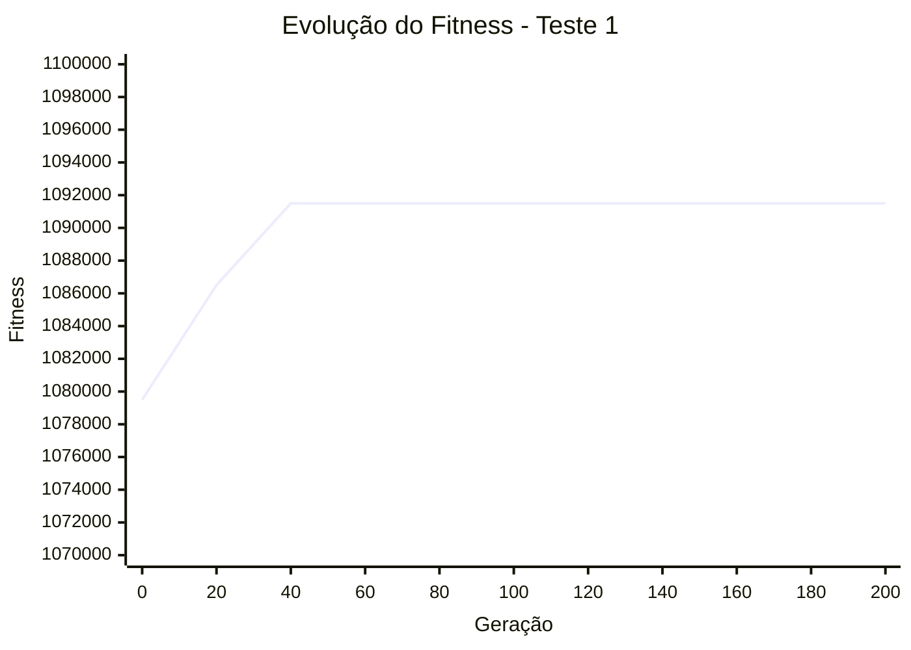

# Estudo de Hiperparâmetros - Alocação de Ambulâncias

Este documento apresenta a análise comparativa do desempenho do Algoritmo Genético variando o tamanho da população e a taxa de mutação.

## 1. Experimentos Realizados

Comparamos uma configuração padrão com uma configuração de maior diversidade genética para avaliar a velocidade de convergência e a eficácia na eliminação de violações de restrições.

### Tabela Comparativa de Resultados

| Configuração | População | Mutação | Melhor Fitness | Geração de Convergência | Violações Finais |
| :--- | :---: | :---: | :---: | :---: | :---: |
| **Teste 1 (Padrão)** | 100 | 0.05 | 1.091.500,00 | ~40 | 0 |
| **Teste 2 (Agressivo)** | 200 | 0.20 | 1.091.500,00 | ~20 | 0 |

---

## 2. Análise de Convergência (Gráficos)

Os gráficos abaixo mostram a evolução do melhor fitness ao longo das gerações.

### Teste 1: População=100, Mutação=0.05
*Descrição: Configuração estável que atingiu a viabilidade total na geração 40.*

```bash 
python src/main.py --populacao 100 --geracoes 200 --mutacao 0.05
```



### Teste 2: População=200, Mutação=0.20
*Descrição: O aumento da população e da mutação acelerou drasticamente a descoberta da solução ótima.*

```bash 
python src/main.py --populacao 200 --geracoes 200 --mutacao 0.20
```


----------

## 3. Discussão dos Resultados

1.  **Impacto da População e Mutação:** O Teste 2, com o dobro da população e quatro vezes mais mutação, alcançou o fitness máximo na **Geração 20**, enquanto o Teste 1 precisou de 40 gerações. Isso indica que para este problema, a exploração (exploration) intensificada foi benéfica.
    
2.  **Estabilidade:** Ambos os testes mantiveram o fitness estável após encontrarem a solução ótima, comprovando a eficácia do **Elitismo** implementado, que protegeu os melhores indivíduos de mutações prejudiciais.
    
3.  **Conclusão:** O algoritmo mostrou-se robusto. Mesmo com uma configuração mais simples, ele é capaz de zerar todas as restrições e maximizar a cobertura populacional em um tempo computacional aceitável.